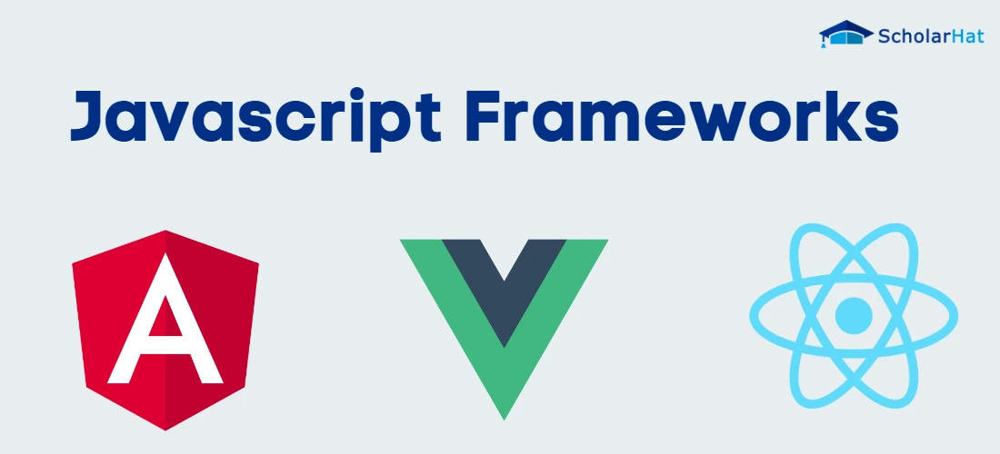
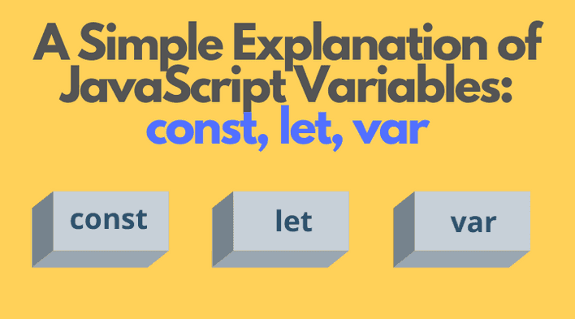
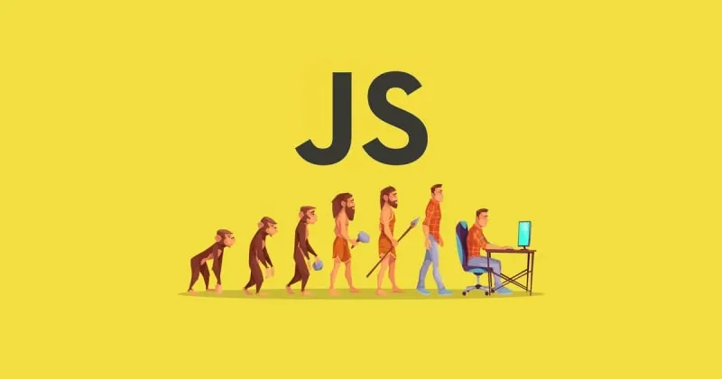
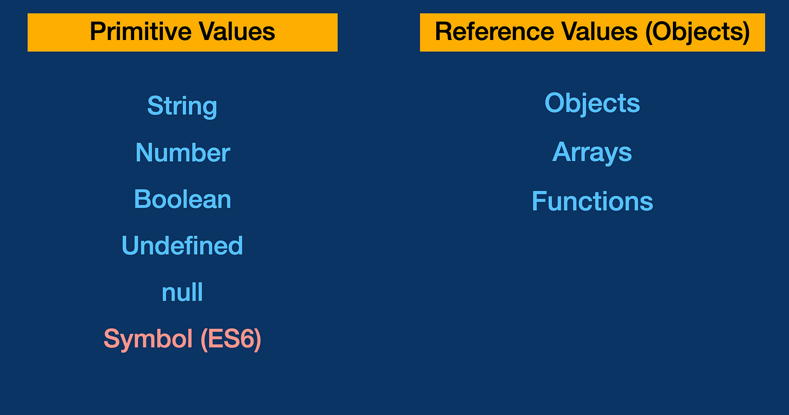

# ----------------JavaScript-----------------

# что такое javascript
+ JavaScript — это язык программирования, который используется в основном для создания интерактивных элементов на веб-страницах. Он позволяет разработчикам добавлять динамическое поведение к страницам, делать их более интерактивными и улучшать пользовательский опыт.

# ==========================
# JS Frameworks

+ 3 самых популярных framework ов js
Вот три самых популярных фреймворка для JavaScript:

+ React.js: Один из самых популярных фреймворков для создания пользовательских интерфейсов. Он используется для построения быстрых и масштабируемых приложений.

+ Vue.js: Легкий и гибкий фреймворк, который позволяет создавать интерактивные пользовательские интерфейсы. Vue.js легко интегрируется с другими библиотеками и инструментами.

+ Angular: Полноценный фреймворк для создания веб-приложений, разработанный Google. Angular предоставляет мощные инструменты для разработки и поддержки приложений.

-------
# Variables

+ JavaScript поддерживает несколько типов значений, которые можно разделить на две основные категории: примитивные типы данных и объектные типы данных. Вот краткий обзор каждого типа:

##  Примитивные типы данных:
- Number: Представляет числовые значения.

- String: Представляет текстовые данные.

- Boolean: Представляет логические значения true или false.

- Undefined: Значение, которое не было присвоено.

- Null: Представляет отсутствующее или пустое значение.

- Symbol: Уникальные и неизменяемые значения.

- BigInt: Целые числа произвольной точности.

## Объектные типы данных:
- Object: Коллекция свойств и методов.

- Array: Упорядоченная коллекция значений.

- Function: Код, который может быть вызван для выполнения.

- JavaScript очень гибкий и мощный язык, позволяющий работать с разными видами данных. Если потребуется дополнительная информация, дайте знать! 🚀
______

# ==========================

+ Давайте погрузимся в историю JavaScript:

+ 1995 - Создание: JavaScript был создан в 1995 году Брэнданом Айком (Brendan Eich) во время его работы в Netscape Communications. Первоначально он назывался Mocha, затем переименован в LiveScript, и, наконец, стал JavaScript.

+ 1996 - Включение в браузеры: В том же году Microsoft создала свою версию языка, названную JScript, и внедрила её в Internet Explorer 3.0. Это положило начало эре кроссбраузерных несовместимостей.

+ 1997 - Стандартизация: JavaScript был стандартизирован под названием ECMAScript международной ассоциацией ECMA International. Первая версия стандарта ECMAScript (ES1) была опубликована в июне 1997 года.

+ 2005 - AJAX и Web 2.0: В 2005 году появился термин AJAX (Asynchronousям обновлять данные без перезагрузки страницы. Это привело к развитию более интерактивных и отзывчивых веб-приложений, часто называемых Web 2.0.

+ 2009 - Node.js: В 2009 году Райан Дал (Ryan Dahl) представил Node.js, платформу на базе JavaScript для выполнения кода на серверной стороне. Это открыло возможности для использования JavaScript в серверной разработке.

+ 2015 - ES6/ECMAScript 2015: Одна из самых значимых версий стандарта ECMAScript была выпущена в 2015 году, известная как ES6 или ECMAScript 2015. Она внесла множество новых возможностей и улучшений, таких как стрелочные функции, классы, let и const, и модули.

+ Настоящее время: JavaScript продолжает активно развиваться. Ежегодно выпускаются новые версии стандарта ECMAScript с новыми функциями и улучшениями.

+ JavaScript остается одним из самых популярных языков программирования, благодаря своей универсальности и способности работать как на клиентской, так и на серверной стороне.
 JavaScript and XML), который позволял веб-приложени

------

## Примитивные типы данных 
+ Number: Числа, как целые, так и дробные.

+ String: Текстовые значения.

+ Boolean: Логические значения true или false.

+ Null: Пустое или несуществующее значение.

+ Undefined: Значение для необъявленных переменных.

+ Symbol: Уникальные идентификаторы.

+ BigInt: Большие целые числа.

## Объекты
+ Объекты — это коллекции свойств, где каждое свойство имеет ключ (имя) и значение. Объекты включают:

+ Простые объекты (например, { ключ: значение })

+ Массивы

+ Функции

+ Даты и другие встроенные объекты.

+ Отличия между примитивами и объектами
Изменяемость: Примитивы неизменяемы, а объекты изменяемы.

+ Сравнение: Примитивы сравниваются по значению, а объекты по ссылке.
