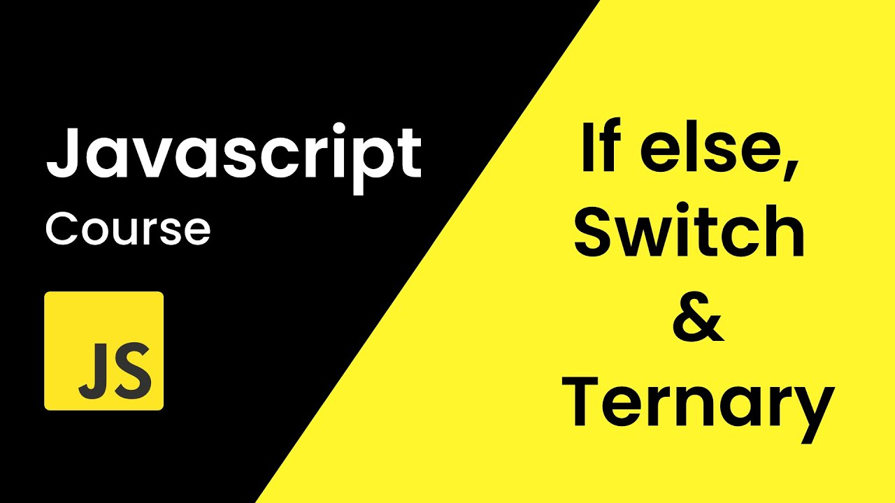
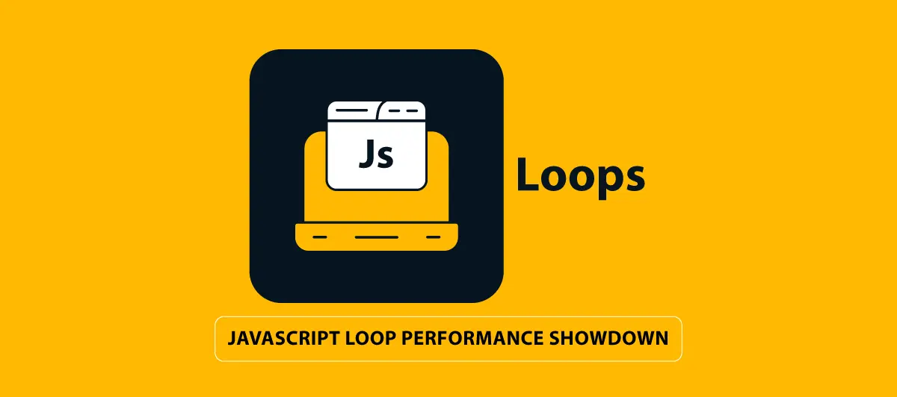
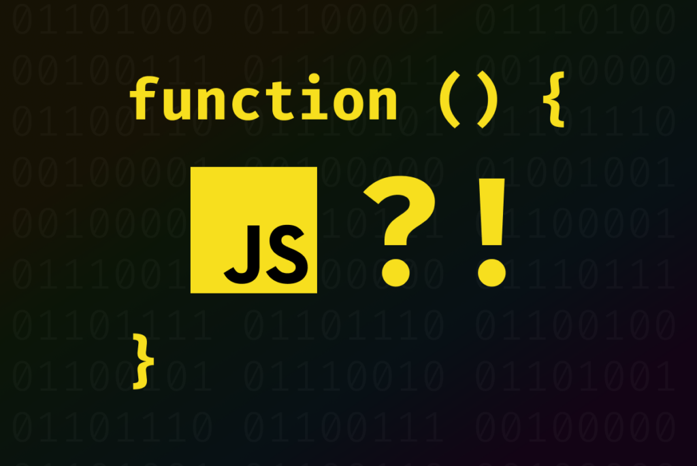

# conditions in JavaScript

## If Else
+ Условные операторы if и else в JavaScript используются для выполнения кода в зависимости от заданных условий. Вот основные концепции:

### Синтаксис if
- Условие, заключенное в круглые скобки, проверяется на истинность. Если условие истинно (true), выполняется блок кода внутри фигурных скобок {}.

### Синтаксис if-else
- Если условие в операторе if ложно (false), выполняется блок кода в else.

### Синтаксис else if
Позволяет добавить дополнительные условия, которые будут проверяться, если все предыдущие условия оказались ложными.

### Примеры использования
- if: Используется для проверки одного условия.

- if-else: Для выполнения альтернативного блока кода, если основное условие ложно.

- if-else if-else: Позволяет проверять несколько условий последовательно.

#### Условные операторы — мощный инструмент для управления потоком выполнения программы в зависимости от различных условий.

## Switch Case

### switch оператор в JavaScript
- switch используется для выполнения различных блоков кода в зависимости от значения переменной или выражения.

### Основные компоненты:
- expression: Значение, которое сравнивается с различными case.

- case value: Определенные значения, с которыми сравнивается expression.

- break: Завершает выполнение текущего блока case.

- default: Выполняется, если ни одно из значений case не совпадает с expression.

### Преимущества:
- Упрощает чтение и написание кода при множественных условиях.

- Легкость добавления новых условий.

### Недостатки:
- Проверяет только на равенство.

- Требует осторожности с оператором break для предотвращения ошибок.

## Ternary
- Тернарный оператор в JavaScript — это компактный способ выполнения условных операторов. Его синтаксис состоит из трех частей:

- Условие: Выражение, которое оценивается как истинное или ложное.

- Если истинно: Результат или действие, которое выполняется, если условие истинно.

- Если ложно: Результат или действие, которое выполняется, если условие ложно.

## while — это цикл в JavaScript, который выполняет блок кода, пока условие истинно. Он продолжает повторять выполнение блока кода до тех пор, пока условие оценивается как true. Как только условие становится false, выполнение цикла прекращается.

### Основные компоненты:
- Условие: Выражение, которое проверяется перед каждой итерацией цикла. Если оно истинно (true), выполняется блок кода.

- Тело цикла: Блок кода, который выполняется при каждой итерации, пока условие истинно.

### Преимущества:
- Полезен для выполнения кода, когда количество итераций заранее неизвестно.

- Продолжает работать до тех пор, пока выполняется заданное условие.

### Ограничения:
- Потенциальная опасность создания бесконечного цикла, если условие никогда не становится ложным.

- Циклы while часто используются, когда необходимо повторить выполнение кода до достижения определенного состояния или события.

## Do While
- Цикл do...while в JavaScript выполняет блок кода хотя бы один раз перед проверкой условия. Это делает его уникальным, так как он гарантирует выполнение тела цикла хотя бы один раз, даже если условие изначально ложно.

### Основные компоненты:
- Тело цикла: Блок кода, который выполняется перед проверкой условия.

- Условие: Выражение, которое проверяется после выполнения тела цикла. Если оно истинно (true), цикл повторяется.

### Преимущества:
- Уверенность в том, что тело цикла выполнится хотя бы один раз.

- Полезен для операций, которые должны быть выполнены хотя бы один раз перед проверкой условия.

### Ограничения:
- Как и любой цикл, может привести к бесконечному выполнению, если условие никогда не станет ложным.

## Js Functions 
### Function Declaration (Объявление функции)
- Объявление функции создает функцию, которая поднимается (hoisted) вверх контекста выполнения, что позволяет вызывать ее до момента объявления.

### Function Expression (Функциональное выражение)
- Функциональные выражения создают функцию, присваивая ее переменной. Такие функции не поднимаются и не могут быть вызваны до их объявления.

### IIFE (Immediately Invoked Function Expression)
- IIFE — это функциональные выражения, которые немедленно вызываются сразу после их создания. Это часто используется для создания локализованной области видимости для данных.