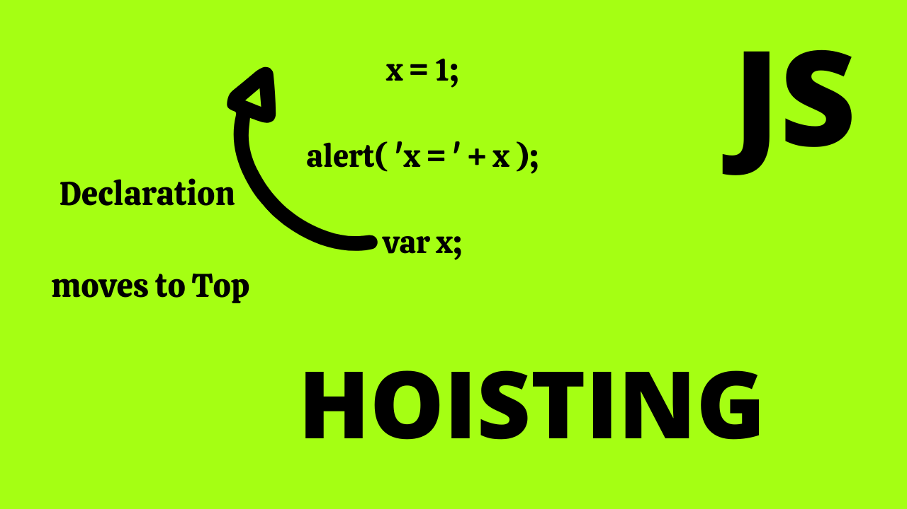

# Scopes in Js

- В JavaScript область видимости (scope) определяет видимость переменных и функций в разных частях вашего кода. Области видимости бывают следующих видов:

- Глобальная область видимости
Переменные и функции, объявленные в глобальной области, доступны в любом месте вашего кода. Обычно это переменные, объявленные вне функций или блоков.

- Функциональная область видимости
Переменные, объявленные внутри функции, доступны только внутри этой функции. Это называется функциональной областью видимости.

- Блочная область видимости
Переменные, объявленные с помощью let и const внутри блоков ({}), например, в циклах или условных операторах, имеют блочную область видимости, то есть доступны только внутри этого блока.

- Лексическая область видимости
Область видимости в JavaScript определяется лексически, то есть на стадии написания кода. Переменные и функции могут быть доступны только в тех местах кода, где они объявлены, и во внутренних областях видимости.

- Замыкания позволяют функции запомнить область видимости, в которой она была создана, даже после того, как эта область будет завершена. Это мощный инструмент для создания модулей и управления приватными данными.

- Область видимости помогает избежать конфликтов переменных и обеспечивает контроль над доступом к данным в вашем коде.

# Hoisting

- Hoisting (поднятие) — это механизм в JavaScript, при котором объявления переменных и функций перемещаются вверх их области видимости перед выполнением кода. Это позволяет использовать функции и переменные до их фактического объявления в коде.

### Механизм hoisting
Функции: Объявления функций поднимаются полностью, включая тело функции. Это означает, что вы можете вызывать функцию до её объявления в коде.

- Переменные: Объявления переменных поднимаются, но их инициализация остается на месте. Это означает, что переменные будут undefined до их инициализации.

- Поднятие функций
Функции, объявленные с помощью function declaration, поднимаются полностью, что позволяет вызывать их до того, как они были определены в коде.

- Поднятие переменных
Переменные, объявленные с помощью var, поднимаются, но инициализация остается на месте. Это означает, что доступ к переменной до её инициализации вернет undefined.

- Переменные, объявленные с помощью let и const, также поднимаются, но находятся в "временной мертвой зоне" (temporal dead zone) до точки инициализации. Это означает, что к ним нельзя обращаться до их фактического объявления.

- Последствия hoisting
Позволяет использовать функции до их объявления.

- Может приводить к непредвиденным результатам, если переменные используются до их инициализации.

- Правильное понимание hoisting помогает избежать ошибок и писать более предсказуемый код.

## TDZ
- TDZ (Temporal Dead Zone) в JavaScript — это концепция, связанная с областью видимости переменных, объявленных с помощью let и const.

### Основные аспекты TDZ:
Что такое TDZ?: Это временной промежуток от начала области видимости переменной до её фактического объявления и инициализации. В течение этого времени доступ к переменной приведет к ошибке ReferenceError.

- Причина TDZ: TDZ существует для предотвращения доступа к переменным до их инициализации, что помогает избежать непредсказуемого поведения кода.

- Поведение: Переменные, объявленные с помощью let и const, поднимаются (hoisted), но остаются в TDZ до точки их инициализации. Попытка доступа к этим переменным до инициализации приводит к ошибке.

- Понимание TDZ помогает писать более безопасный и предсказуемый код, избегая ошибок, связанных с преждевременным доступом к переменным.
